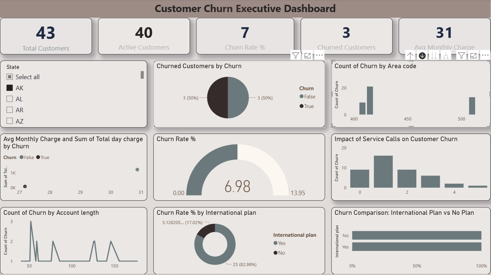

# Customer Churn Executive Dashboard — Power BI

<p align="center">
  
  
  
  
  
</p>

<p align="center">
  An interactive Power BI dashboard analyzing <strong>customer churn patterns</strong>, service usage, and key retention metrics to support data-driven decision-making for telecom businesses.
</p>

<p align="center">
  <a href="#-demo">Demo</a> •
  <a href="#-objective">Objective</a> •
  <a href="#-key-metrics">Key Metrics</a> •
  <a href="#-dashboard-features">Features</a> •
  <a href="#-data-dictionary">Data Dictionary</a> •
  <a href="#-getting-started">Getting Started</a> •
  <a href="#-key-insights">Insights</a> •
  <a href="#-author">Author</a>
</p>

---

## Demo

<p align="center">
  
</p>

> A walkthrough video is available in [`Video-of-an-output.mp4`](Video-of-an-output.mp4).

---

## Objective

Customer churn is one of the most critical challenges in the telecom industry. This dashboard provides executives with a **single-pane view** of churn drivers, enabling them to:

- Identify high-risk customer segments
- Understand the impact of service calls on churn
- Evaluate the relationship between plan types and customer retention
- Pinpoint geographic regions with elevated churn concentration

---

## Key Metrics

| Metric | Description |
|--------|-------------|
| **Total Customers** | Total customer base in the dataset |
| **Active Customers** | Customers who have not churned |
| **Churned Customers** | Customers who have left the service |
| **Churn Rate %** | Percentage of customers who churned |
| **Average Monthly Charge** | Mean monthly billing amount across all customers |

---

## Dashboard Features

- **State-wise Churn Distribution** — Geographic heatmap of churn concentration across U.S. states
- **Service Call Impact Analysis** — Correlation between customer service call frequency and churn probability
- **International Plan Comparison** — Churn behavior segmented by international plan subscription
- **Voice Mail Plan Analysis** — Retention metrics grouped by voice mail plan adoption
- **Account Length Trend** — Churn patterns relative to customer tenure
- **Interactive Filters** — Drill-down by state, area code, plan type, and usage metrics
- **KPI Cards** — At-a-glance summary of core retention metrics

---

## Data Dictionary

The dataset contains **3,333 customer records** with **20 features**:

| Feature | Type | Description |
|---------|------|-------------|
| `State` | Categorical | U.S. state of the customer |
| `Account length` | Numerical | Duration of customer account (in days) |
| `Area code` | Categorical | Telephone area code |
| `International plan` | Binary | Whether the customer has an international plan (`Yes`/`No`) |
| `Voice mail plan` | Binary | Whether the customer has a voice mail plan (`Yes`/`No`) |
| `Number vmail messages` | Numerical | Number of voice mail messages |
| `Total day minutes` | Numerical | Total minutes used during the day |
| `Total day calls` | Numerical | Total calls made during the day |
| `Total day charge` | Numerical | Total charge for daytime usage |
| `Total eve minutes` | Numerical | Total minutes used during the evening |
| `Total eve calls` | Numerical | Total calls made during the evening |
| `Total eve charge` | Numerical | Total charge for evening usage |
| `Total night minutes` | Numerical | Total minutes used during the night |
| `Total night calls` | Numerical | Total calls made during the night |
| `Total night charge` | Numerical | Total charge for nighttime usage |
| `Total intl minutes` | Numerical | Total international minutes used |
| `Total intl calls` | Numerical | Total international calls made |
| `Total intl charge` | Numerical | Total charge for international usage |
| `Customer service calls` | Numerical | Number of calls to customer service |
| `Churn` | Binary | Whether the customer churned (`True`/`False`) |

---

## Getting Started

### Prerequisites

- [Microsoft Power BI Desktop](https://powerbi.microsoft.com/downloads/) (latest version recommended)
- Windows 10 or later

### Installation

1. **Clone the repository**
   ```bash
   git clone https://github.com/methila-2056/Customer-Churn-Executive-Dashboard-PowerBI.git
   ```

2. **Open the project**
   - Navigate to the cloned directory
   - Double-click `Customer-Churn-Executive-Dashboard.pbix` to open in Power BI Desktop

3. **Refresh the data**
   - In Power BI, go to **Home** → **Refresh** to load the latest data from `churn-bigml-80.csv`

4. **Explore the dashboard**
   - Use the filters and slicers to drill down into specific segments
   - Hover over visuals for detailed tooltips

---

## Key Insights

| Insight | Detail |
|---------|--------|
| **Service Calls Drive Churn** | Customers with **4+ service calls** show a significantly higher churn probability |
| **International Plan Impact** | Customers subscribed to international plans exhibit distinct churn behavior compared to non-subscribers |
| **Geographic Hotspots** | Certain states (e.g., NJ, CA, TX) show elevated churn concentrations |
| **Tenure Matters** | Customers with shorter account lengths are more likely to churn |
| **Charge Correlation** | Monthly charges show a slight correlation with churn trends |

---

## Project Structure

```
Customer-Churn-Executive-Dashboard-PowerBI/
├── churn-bigml-80.csv                          # Source dataset (3,333 records)
├── Customer-Churn-Executive-Dashboard.pbix         # Power BI dashboard file
├── Image-of-a-output.png                       # Dashboard screenshot
├── Video-of-an-output.mp4                      # Dashboard walkthrough video
├── CONTRIBUTING.md                              # Contribution guidelines
├── LICENSE                                      # MIT License
└── README.md                                    # Project documentation
```

---

## Tools & Technologies

| Tool | Purpose |
|------|---------|
| **Microsoft Power BI** | Dashboard creation and data visualization |
| **DAX** | Calculated measures, KPIs, and conditional logic |
| **Power Query (M)** | Data transformation and cleaning |
| **Data Modeling** | Relationship management between tables |

---

## Methodology

1. **Data Collection** — Customer records sourced from telecom service provider dataset
2. **Data Cleaning** — Handled missing values, standardized formats, and validated data integrity
3. **Exploratory Analysis** — Identified patterns and correlations using statistical analysis
4. **Dashboard Design** — Created interactive visuals following data visualization best practices
5. **Insight Generation** — Derived actionable insights for retention strategy development

---

## FAQ

**Q: What version of Power BI do I need?**
A: Power BI Desktop latest version (2024 or later recommended).

**Q: Can I use this dashboard with my own data?**
A: Yes. Replace `churn-bigml-80.csv` with your dataset and update the data source in Power BI.

**Q: How do I refresh the data?**
A: Open the `.pbix` file in Power BI Desktop and click **Home** → **Refresh**.

**Q: Is this dashboard mobile-friendly?**
A: The dashboard is optimized for desktop viewing. Mobile layout can be configured in Power BI Service.

---

## Author

**METHILA M**

<p align="left">
  <a href="https://github.com/methila-2056">
    
  </a>
  <a href="https://www.linkedin.com/in/">
    
  </a>
</p>

---

## License

This project is licensed under the **MIT License** — see the [LICENSE](LICENSE) file for details.

---

<p align="center">
  If you found this project helpful, consider giving it a ⭐ on <a href="https://github.com/methila-2056/Customer-Churn-Executive-Dashboard-PowerBI">GitHub</a>.
</p>
